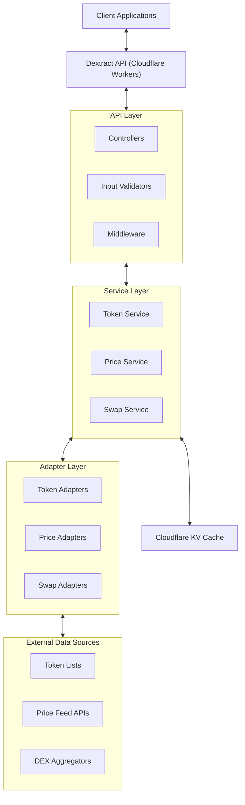
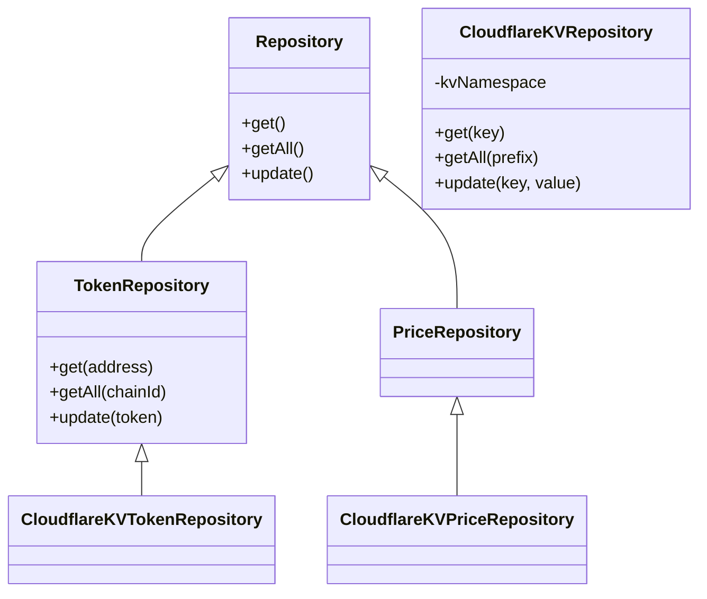
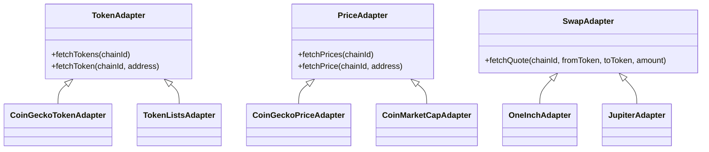
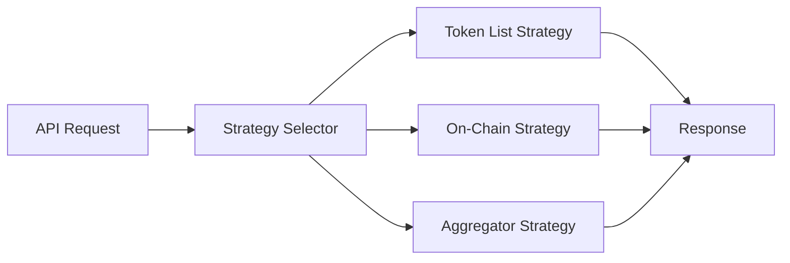
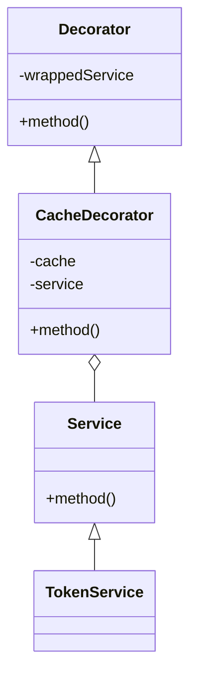
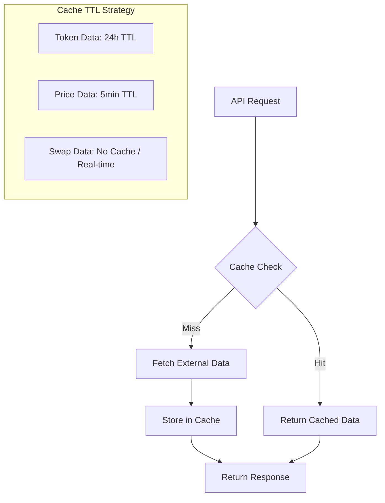
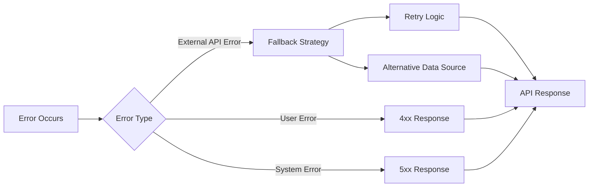
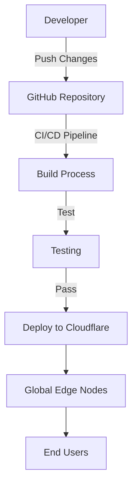

# DEX (dextract-fi) API

This repository contains the backend API for the Dextract Finance platform, providing centralized access to decentralized exchange data across multiple blockchains.

## Architecture Overview

The Dextract API is built with a modular, cloud-native architecture designed for performance, scalability, and extensibility.

### Tech Stack

- **Framework**: NestJS with Fastify adapter
- **Runtime**: Cloudflare Workers
- **Storage**: Cloudflare KV for caching
- **Language**: TypeScript
- **Documentation**: Swagger/OpenAPI
- **Design Pattern**: Modular, service-oriented architecture

### Architecture Diagram



### Directory Structure

```
dextract-api/
├── src/                      # Main source code
│   ├── api/                  # API layer
│   │   ├── controllers/      # API endpoints 
│   │   ├── dto/              # Data Transfer Objects
│   │   ├── middleware/       # Request/response middleware
│   │   ├── routes/           # API route definitions
│   │   └── validators/       # Request validation
│   ├── services/             # Business logic
│   │   ├── tokens/           # Token-related services
│   │   ├── prices/           # Price-related services
│   │   └── swaps/            # Swap-related services
│   ├── workers/              # Cloudflare Worker configurations
│   ├── utils/                # Utility functions
│   └── config/               # Application configuration
├── packages/                 # Shared packages
│   ├── common/               # Common utilities, types, and constants
│   ├── api-client/           # API client for frontend consumption
│   └── blockchain/           # Blockchain-specific adapters
├── scripts/                  # Build and deployment scripts
├── docs/                     # Documentation
└── config/                   # Configuration files
```

## Design Patterns

The Dextract API implements several design patterns to ensure maintainability, extensibility, and clean architecture:

### 1. Repository Pattern

Abstracts data access logic, allowing for easy switching between data sources.



### 2. Adapter Pattern

Enables integration with various external APIs through a standardized interface.



### 3. Strategy Pattern

Allows for dynamically selecting the optimal data retrieval method based on context.



### 4. Decorator Pattern

Adds caching capabilities to service methods without modifying their core behavior.



## API Documentation

The API provides comprehensive documentation using Swagger/OpenAPI, which allows for:

- Interactive API exploration
- Request/response schema visualization
- API testing directly from the browser
- Automatic client generation

### Accessing the API Documentation

When running the API locally, the Swagger UI is available at:

```
http://localhost:3000/api/docs
```

### Generating Documentation Files

You can generate static documentation files using the following commands:

```bash
# Generate API documentation
npm run docs:generate

# Serve documentation locally
npm run docs:serve

# List all API endpoints with their definitions
npm run api:list
```

This will create:
- `docs/api-endpoints.json` - JSON file with all endpoints
- `docs/openapi-spec.json` - Complete OpenAPI specification
- `docs/api-docs.md` - Markdown documentation

## API Endpoints

The API provides the following endpoints:

### Token Endpoints

```
GET /api/tokens/:chainId - Get all tokens for a specific chain
GET /api/tokens/:chainId/:address - Get token details by address
```

### Price Endpoints

```
GET /api/prices/:chainId - Get prices for all tokens on a chain
GET /api/prices/:chainId/:address - Get price for a specific token
```

### Swap Endpoints

```
GET /api/swaps/quote/:chainId?fromToken=&toToken=&amount= - Get swap quotes
```

## Extending the API

### Adding New Chains

To add support for a new blockchain:

1. Add the new chain ID to the `ChainId` enum in `packages/common/constants/chains.constants.ts`
2. Create appropriate chain-specific adapters in the `packages/blockchain/adapters` directory
3. Update services to support the new chain's data format and requirements

Example of adding a new chain:

```typescript
// Step 1: Add to ChainId enum
export enum ChainId {
  ETHEREUM = 1,
  SOLANA = 101,
  AVALANCHE = 43114, // New chain
}

// Step 2: Add chain name
export const CHAIN_NAMES: Record<ChainId, string> = {
  [ChainId.ETHEREUM]: 'Ethereum',
  [ChainId.SOLANA]: 'Solana',
  [ChainId.AVALANCHE]: 'Avalanche', // New chain
};

// Step 3: Add RPC URLs
export const CHAIN_RPC_URLS: Record<ChainId, string[]> = {
  [ChainId.ETHEREUM]: ['https://eth.llamarpc.com'],
  [ChainId.SOLANA]: ['https://api.mainnet-beta.solana.com'],
  [ChainId.AVALANCHE]: ['https://api.avax.network/ext/bc/C/rpc'], // New chain
};
```

### Implementing New Data Source Adapters

To integrate with a new external API:

1. Create a new adapter class that implements the appropriate adapter interface
2. Register the adapter in the corresponding service's adapter registry
3. Implement the adapter's methods to fetch and transform data from the external API

Example:

```typescript
// New Price Adapter
import { PriceAdapter } from './price-adapter.interface';
import { TokenPrice } from '@common/types/price.types';
import { ChainId } from '@common/constants/chains.constants';

export class NewPriceAPIAdapter implements PriceAdapter {
  async fetchPrices(chainId: ChainId): Promise<TokenPrice[]> {
    // Implementation for the new API
  }
  
  async fetchPrice(chainId: ChainId, address: string): Promise<TokenPrice | null> {
    // Implementation for the new API
  }
}
```

## Caching Strategy

The API implements a multi-level caching strategy to optimize performance and reduce external API calls:



### Cache Invalidation

- **Token Data**: Long TTL (24 hours) with webhook-based invalidation for updates
- **Price Data**: Short TTL (5 minutes) with conditional updates for high-volume tokens
- **Swap Data**: Real-time data with no caching or extremely short TTL (seconds)

## Error Handling

The API implements a standardized error handling strategy:



## Deployment

The API is designed to be deployed on Cloudflare Workers for optimal global performance:



## Getting Started

### Prerequisites

- Node.js (v18+)
- npm or yarn
- Cloudflare account (for deployment)

### Installation

```bash
# Clone the repository
git clone https://github.com/your-org/dextract-api.git

# Install dependencies
cd dextract-api
npm install

# Create .env file
cp .env.example .env
```

### Development

```bash
# Start development server
npm run start:dev

# Run tests
npm test

# Build for production
npm run build

# Generate API documentation
npm run docs:generate
```

### API Documentation for Frontend Developers

For frontend developers who need to integrate with the API:

1. Access the interactive Swagger UI at `http://localhost:3000/api/docs`
2. Use the generated OpenAPI specification (`docs/openapi-spec.json`) to generate client code
3. Reference the markdown documentation (`docs/api-docs.md`) for a comprehensive API reference

Tools like Postman, Insomnia, or OpenAPI Generator can automatically generate client code from the OpenAPI specification.

### Deployment to Cloudflare Workers

```bash
# Install Wrangler CLI
npm install -g wrangler

# Login to Cloudflare
wrangler login

# Deploy
wrangler publish
```

## Contributing

Contributions are welcome! Please feel free to submit a Pull Request.

1. Fork the repository
2. Create your feature branch (`git checkout -b feature/amazing-feature`)
3. Commit your changes (`git commit -m 'Add some amazing feature'`)
4. Push to the branch (`git push origin feature/amazing-feature`)
5. Open a Pull Request

## License

This project is licensed under the MIT License - see the LICENSE file for details.