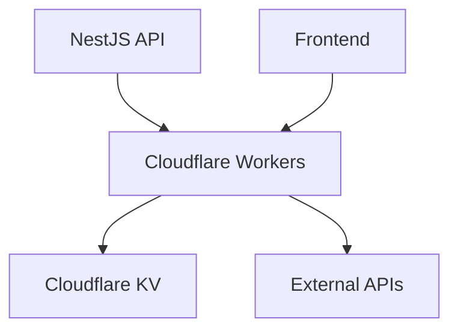
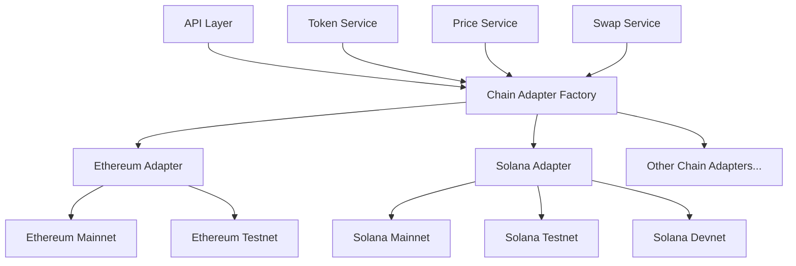
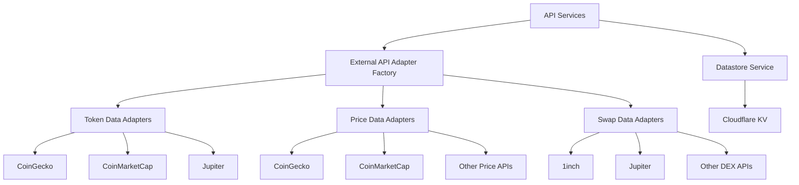

# Architecture Diagrams for Dextract-fi API

*[Back to README](../README.md) | [API Documentation](./api-docs.md) | [Architecture Overview](./architecture-flow.md) | [Implementation Summary](./implementation-summary.md)*

This document provides additional visual representations of the Dextract-fi API architecture to complement the diagrams in the [Architecture Overview](./architecture-flow.md).

## Deployment Architecture



## Chain and Network Architecture



## External API Integration Framework



## Data Type TTL Strategy

```mermaid
flowchart TD
    A[Data Types] --> B[Token Lists]
    A --> C[Token Details]
    A --> D[Price Data]
    A --> E[Swap Quotes]
    
    B --> F[24h TTL, Check for New Tokens]
    C --> G[Indefinite TTL]
    D --> H[5m TTL, Frequent Updates]
    E --> I[No Cache, Real-time Only]