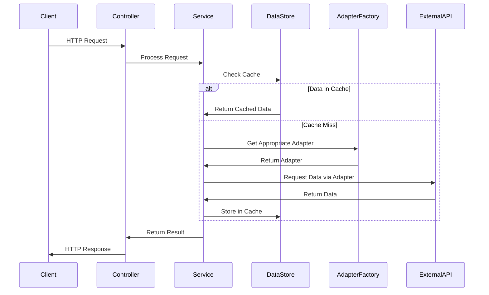
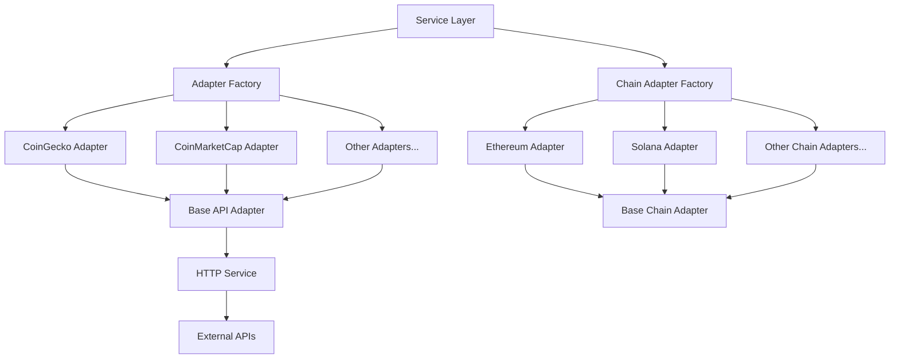
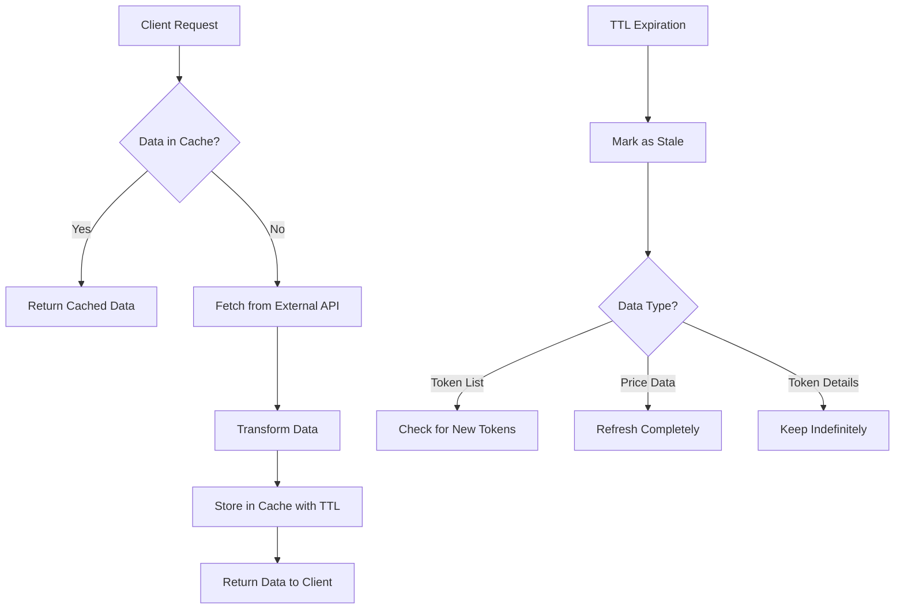
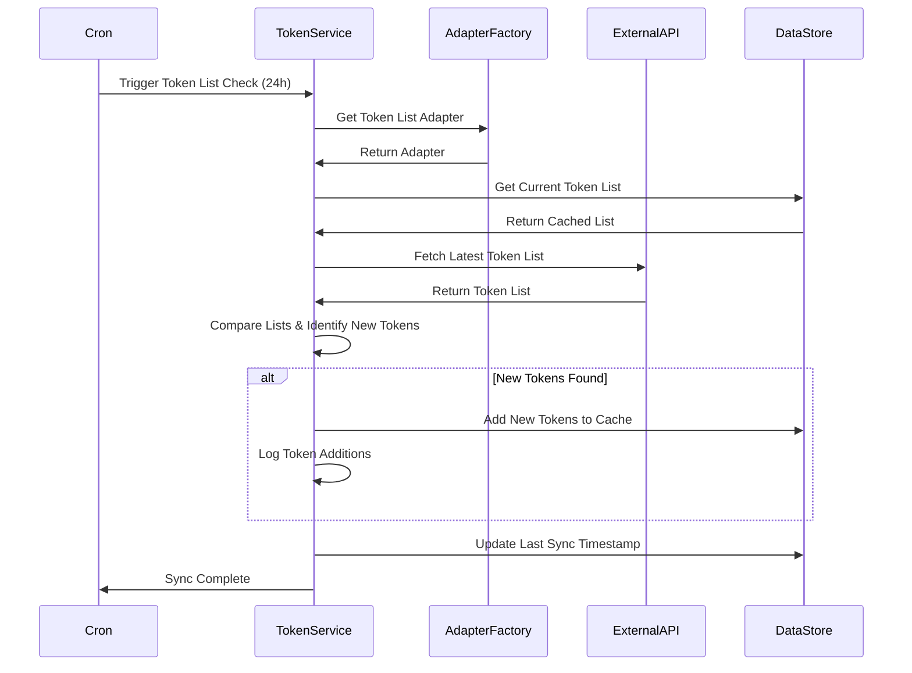

# Architecture Flow and Responsibilities

*[Back to README](../README.md) | [API Documentation](./api-docs.md) | [Architecture Diagrams](./architecture-diagrams.md) | [Implementation Summary](./implementation-summary.md)*

This document explains the flow of responsibilities and data in the architecture for the Dextract-fi API.

## Component Responsibilities

### 1. API Controllers
- Handle HTTP requests and parameter validation
- Route requests to appropriate services
- Format and return responses
- Apply security policies (CORS, rate limiting)
- Provide backward compatibility through legacy endpoints

### 2. Service Layer
- Orchestrate business logic
- Determine which data source to use (cache or external API)
- Handle error cases and provide fallbacks
- Manage data transformation
- Coordinate between different adapters

### 3. External API Adapter Framework
- Abstract away external API specifics
- Handle authentication with external APIs
- Transform external API responses to internal format
- Implement retry logic and error handling
- Support multiple providers (CoinGecko, CoinMarketCap, etc.)

### 4. Chain-Network Adapters
- Provide chain and network specific functionality
- Handle address normalization
- Manage chain-specific data formats
- Abstract away chain and network differences
- Support multiple networks per chain (mainnet, testnet, etc.)

### 5. Datastore Service
- Provide a unified interface to the storage layer
- Handle caching logic with different TTL strategies
- Manage TTL and expiration
- Support different storage backends (Memory, Cloudflare KV)
- Implement efficient cache invalidation

### 6. Cron Service
- Schedule and execute periodic tasks
- Check for new tokens every 24 hours
- Refresh price data more frequently
- Manage synchronization with external APIs
- Respect rate limits

## Data Flow Diagrams

### Request-Response Flow

### Adapter Pattern Implementation

### Caching Mechanism

### Token List Synchronization Process

## Detailed Flow Examples

### 1. Token Information Request Flow

1. **Client Request**: Frontend requests token information for "SOL" on Solana mainnet
2. **Controller Processing**: 
   - `TokensController` receives request
   - Validates parameters
   - Calls `TokensService.getToken("solana", "mainnet", "SOL")`
3. **Service Layer**:
   - Normalizes parameters
   - Checks cache via `DataStoreService.get("tokens:solana:mainnet:SOL")`
4. **Cache Check**:
   - If found, return cached data (token data has indefinite TTL)
   - If not found, proceed to external API
5. **External API Request**:
   - Get appropriate adapter via `TokenApiAdapterFactory.getAdapter("coingecko")`
   - Fetch data via adapter: `adapter.getToken("solana", "mainnet", "SOL")`
   - Adapter handles API-specific details and transforms response
6. **Cache Update**:
   - Store fetched data in cache with indefinite TTL
   - `DataStoreService.set("tokens:solana:mainnet:SOL", tokenData, { ttl: null })`
7. **Response**:
   - Return data to controller
   - Controller formats and returns HTTP response

### 2. Token List Discovery Flow

1. **Cron Trigger**:
   - `CronService` triggers `checkForNewTokens()` every 24 hours
2. **Service Orchestration**:
   - `TokensService` determines which chains and networks to check
   - For each chain-network pair, determines which adapter to use
3. **Current List Retrieval**:
   - Fetches current token list from cache
4. **External API Interaction**:
   - Fetches latest token list via appropriate adapters
   - Respects rate limits and handles errors
5. **List Comparison**:
   - Compares current list with new list to identify new tokens
   - If new tokens are found, adds them to the cache
6. **Cache Update**:
   - Updates token list in cache with new tokens
   - Keeps existing token data
   - Updates last sync timestamp
7. **Completion**:
   - Logs any new tokens found
   - Prepares for next scheduled run

### 3. Price Data Request Flow

1. **Client Request**: Frontend requests price for "SOL" on Solana mainnet
2. **Controller Processing**: 
   - `PricesController` receives request
   - Validates parameters
   - Calls `PricesService.getPrice("solana", "mainnet", "SOL")`
3. **Service Layer**:
   - Normalizes parameters
   - Checks cache via `DataStoreService.get("prices:solana:mainnet:SOL")`
4. **Cache Check**:
   - If found and not expired (5 min TTL), return cached data
   - If not found or expired, proceed to external API
5. **External API Request**:
   - Get appropriate adapter via `PriceApiAdapterFactory.getAdapter("coingecko")`
   - Fetch data via adapter: `adapter.getPrice("solana", "mainnet", "SOL")`
   - Adapter handles API-specific details and transforms response
6. **Cache Update**:
   - Store fetched data in cache with short TTL
   - `DataStoreService.set("prices:solana:mainnet:SOL", priceData, { ttl: 5 * 60 * 1000 })`
7. **Response**:
   - Return data to controller
   - Controller formats and returns HTTP response

### 4. Swap Quote Request Flow

1. **Client Request**: Frontend requests swap quote for USDC to ETH on Ethereum mainnet
2. **Controller Processing**:
   - `SwapsController` receives request
   - Validates parameters
   - Calls `SwapsService.getQuote("ethereum", "mainnet", "USDC", "ETH", "1000000000")`
3. **Service Layer**:
   - Normalizes parameters
   - Gets token information for both tokens
4. **External API Request**:
   - Get appropriate adapter via `SwapApiAdapterFactory.getAdapter("1inch")`
   - Fetch quote via adapter: `adapter.getSwapQuote(...)`
   - Adapter handles API-specific details and transforms response
5. **Response**:
   - Return quote data to controller
   - Controller formats and returns HTTP response with best route and alternatives

## Key Benefits of This Architecture

1. **Separation of Concerns**:
   - Each component has a clear, single responsibility
   - Components can be developed and tested independently

2. **Flexibility**:
   - Easy to add new data sources, chains, or networks
   - Can switch between different external APIs without changing business logic

3. **Resilience**:
   - Graceful handling of external API failures
   - Fallback mechanisms and caching reduce dependency on external services

4. **Performance**:
   - Efficient caching reduces external API calls
   - Token data stored indefinitely, only checking for new tokens periodically
   - Price data refreshed more frequently to maintain accuracy

5. **Maintainability**:
   - Clear interfaces between components
   - Consistent patterns across different data types
   - Easier to understand and extend

6. **Multi-Chain Support**:
   - Support for multiple chains (Ethereum, Solana, BSC, etc.)
   - Support for multiple networks per chain (mainnet, testnet, etc.)
   - Chain-agnostic API design

## Cloudflare Workers Deployment

The API is designed to be deployed to Cloudflare Workers, with the following configuration:

1. **KV Namespace**: Used for caching token and price data
2. **Environment Variables**: Configured in wrangler.toml
3. **Secrets**: API keys stored securely using Cloudflare's secret management
4. **Security Headers**: Configured for secure frontend access
5. **CORS**: Configured to allow access from specified origins